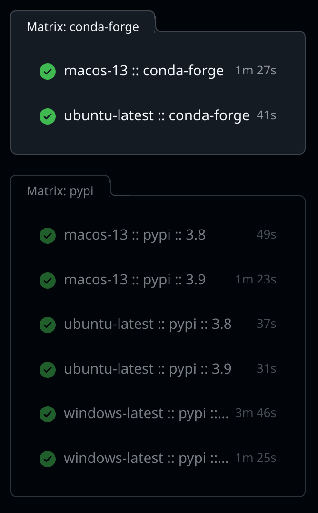

# Continuous Integration

Every commit to this repository is tested using continuous integration (CI).
This ensures that the code is always working and that new changes do not break existing functionality.

## GitHub Actions

The CI is implemented using [GitHub Actions](https://github.com/features/actions).
The example notebooks and the example scripts from [github.com/ZhaoWenzhao/QHCC](https://github.com/ZhaoWenzhao/QHCC) are
run in the CI to ensure that they are working as expected, on all supported platforms.

This is done for different Python versions (3.8, 3.9), operating systems (Linux, Windows, Mac) and dependency managers (pip and conda):

This website is also built and deployed as part of this CI process.
